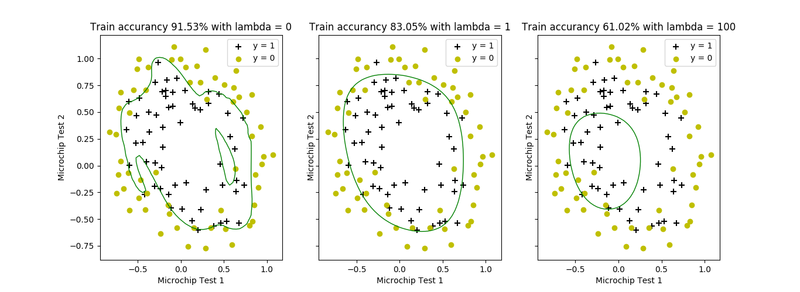

# Regulized Logistic Regression

In this part of the exercise, you will implement regularized logistic regression
to predict whether microchips from a fabrication plant passes quality assurance (QA). During QA, each microchip goes through various tests to ensure
it is functioning correctly.
Suppose you are the product manager of the factory and you have the
test results for some microchips on two different tests. From these two tests,
you would like to determine whether the microchips should be accepted or
rejected. To help you make the decision, you have a dataset of test results
on past microchips, from which you can build a logistic regression model.

## Visualizing the data

Similar to the previous parts of this exercise, plotData is used to generate a
figure like Figure 3, where the axes are the two test scores, and the positive
(y = 1, accepted) and negative (y = 0, rejected) examples are shown with
different markers.

Figure 3 shows that our dataset cannot be separated into positive and
negative examples by a straight-line through the plot. Therefore, a straightforward application of logistic regression will not perform well on this dataset
since logistic regression will only be able to find a linear decision boundary.
## Feature mapping

One way to fit the data better is to create more features from each data
point. In the provided function mapFeature, we will map the features into
all polynomial terms of x1 and x2 up to the sixth power.

As a result of this mapping, our vector of two features (the scores on
two QA tests) has been transformed into a 28-dimensional vector. A logistic
regression classifier trained on this higher-dimension feature vector will have
a more complex decision boundary and will appear nonlinear when drawn in
our 2-dimensional plot.
While the feature mapping allows us to build a more expressive classifier,
it also more susceptible to overfitting. In the next parts of the exercise, you
will implement regularized logistic regression to fit the data and also see for
yourself how regularization can help combat the overfitting problem.

## Cost function and gradient

Now you will implement code to compute the cost function and gradient for
regularized logistic regression. Complete the code in method costFunctionReg() to
return the cost and gradient.
Recall that the regularized cost function in logistic regression is

Note that you should not regularize the parameter θ0. The gradient
of the cost function is a vector where the jth element is defined as follows:

Once you are done, call your costFunctionReg method
using the initial value of θ (initialized to all zeros). You should see that the
cost is about 0.693

## Plotting boundary

To help you visualize the model learned by this classifier, we have provided the function plotDecisionBoundary which plots the (non-linear)
decision boundary that separates the positive and negative examples. In
plotDecisionBoundary, we plot the non-linear decision boundary by computing the classifier’s predictions on an evenly spaced grid and then and drew
a contour plot of where the predictions change from y = 0 to y = 1.
After learning the parameters θ, the next step will plot a
decision boundary similar to Figure 4.

